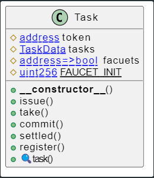
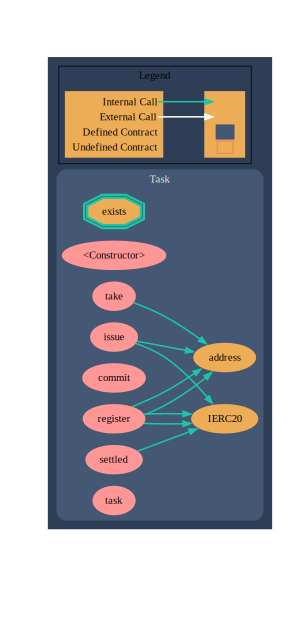

# Project : Task Live

## Solidity Contract

**Task**



```
Sighash   |   Function Signature
========================
9169d937  =>  issue(uint256,string)
4fd9efc4  =>  take(uint256)
f4f98ad5  =>  commit(uint256)
e5992bbf  =>  settled(uint256,string,bool)
4420e486  =>  register(address)
17751a21  =>  task(uint256)
```



```bash
# Test Passing
➜  solidity_code git:(main) ✗ npx hardhat test ./test/task.js


  Task Contract
    ✔ Should fullfill all status of task (1814ms)


  1 passing (2s)
```

## Go Backend

1. Init [Gin](https://github.com/gin-gonic) framework
```go
package main

import (
  "net/http"

  "github.com/gin-gonic/gin"
)

func main() {
  r := gin.Default()
  r.GET("/ping", func(c *gin.Context) {
    c.JSON(http.StatusOK, gin.H{
      "message": "pong",
    })
  })
  r.Run() // listen and serve on 0.0.0.0:8080 (for windows "localhost:8080")
}
```

```bash
go mod init {moudle-name}
go mod tidy
go get github.com/gin-gonic/gin
go run main.go
```

2. 获取abigen可执行文件([项目go-sdk](https://github.com/FISCO-BCOS/go-sdk))
```bash
go build ./cmd/abigen
```

3. 准备合约abi文件
```
go_code
  ⌞abigen
  ⌞task
    ⌞ task.abi
```

4. 生成go合约代码
```bash
./abigen --abi ./task/task.abi --pkg task --type Task --out ./task/Task.go
```